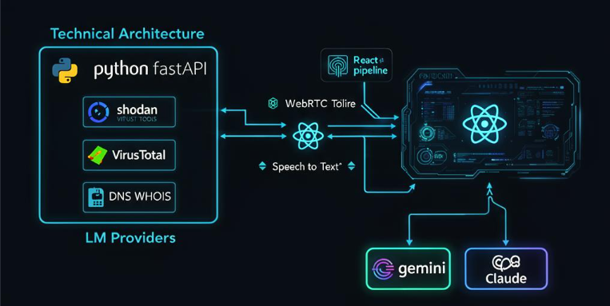
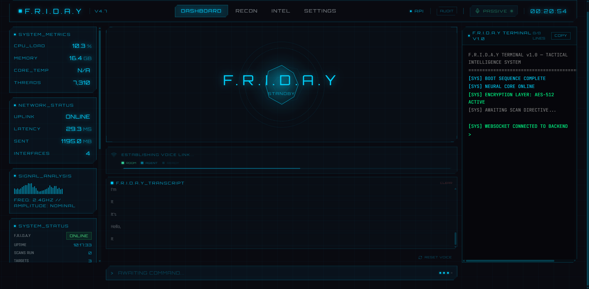
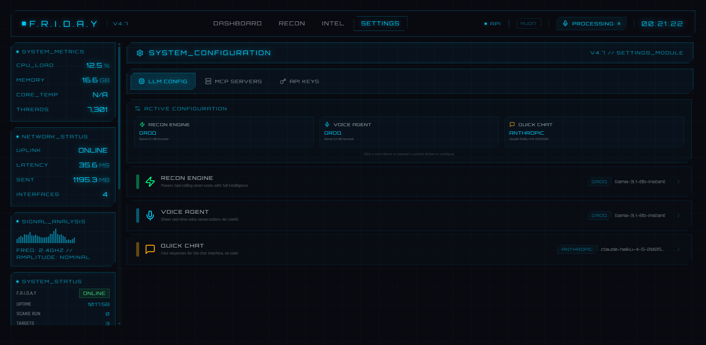
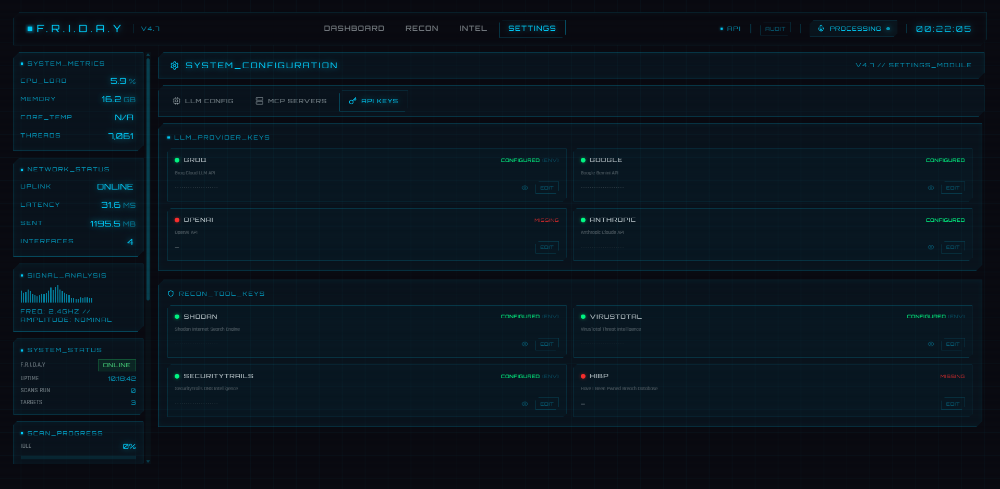

# F.R.I.D.A.Y. - AI-Powered Cybersecurity Reconnaissance Assistant

> *"Just a rather very intelligent digital assistant, Boss."*

A voice-controlled AI cybersecurity reconnaissance platform inspired by Tony Stark's F.R.I.D.A.Y. Talk to it, and it scans real targets using Shodan, VirusTotal, SecurityTrails, and more - then delivers tactical intelligence reports.

---

## Technical Architecture



---

## What It Does

Say **"FRIDAY, run recon on example.com"** and it simultaneously runs:

- **DNS Recon** - A, MX, NS, TXT, CNAME records
- **WHOIS Lookup** - Registrar, expiry, nameservers
- **Subdomain Enumeration** - SecurityTrails API + brute force
- **HTTP Header Analysis** - Security misconfigurations
- **OSINT / VirusTotal** - Domain reputation, detections
- **IP Recon / Shodan** - Geolocation, exposed services, vulnerabilities
- **Port Scanning** - Open services detection
- **Cyber News** - Latest headlines from Hacker News, BleepingComputer, CISA, Krebs

Then delivers a tactical voice briefing and generates a professional intelligence report with PDF export.

---

## Features

- **Voice Control** - Real-time conversation via LiveKit WebRTC
- **8 Recon Tools** - Running concurrently with real API data
- **Intelligence Reports** - Risk scoring, LLM-generated assessment, PDF export
- **Scan Archive** - All scans stored persistently and browsable
- **Cyber News Feed** - RSS from top security sources
- **Hot-Swappable LLM** - Groq, Google Gemini, Anthropic Claude, OpenAI, Ollama
- **MCP Protocol** - Extend with external tool servers
- **Iron Man HUD** - Real-time CPU, memory, network metrics
- **Persistent Transcript** - Voice conversations stored in localStorage
- **No Hardcoded Keys** - All API keys configurable via UI or .env file

---

## Screenshots

### Dashboard - Iron Man HUD


### Settings - LLM Configuration


### Settings - API Keys Management


---

## Architecture

```
Browser (React + Tailwind)
    |
    |-- WebSocket ---> FastAPI Backend (35+ endpoints)
    |                       |-- LLM Brain (dual-pass tool calling)
    |                       |-- 8 Recon Tools
    |                       |-- MCP Client
    |                       +-- Settings Manager
    |
    +-- WebRTC ------> LiveKit Server
                          +-- Voice Agent
                               |-- Groq Whisper STT
                               |-- LLM (configurable)
                               +-- Edge-TTS (Irish accent)
```

---

## Prerequisites

- **Python 3.11+**
- **Node.js 18+**
- **Git**
- At least one LLM API key (Groq is free and recommended to start)

---

## Installation

### 1. Clone the Repository

```bash
git clone https://github.com/YOUR_USERNAME/F.R.I.D.A.Y.git
cd F.R.I.D.A.Y
```

### 2. Backend Setup

```bash
cd backend

# Create virtual environment
python -m venv venv

# Activate it
# Windows:
venv\Scripts\activate
# macOS/Linux:
source venv/bin/activate

# Install dependencies
pip install -r requirements.txt

# Copy environment config
cp .env.example .env
```

### 3. Configure API Keys

Edit `backend/.env` and add your API keys. **All keys are configurable - nothing is hardcoded.**

```env
# REQUIRED - at least one LLM provider
GROQ_API_KEY=your_key_here        # Free at https://console.groq.com/keys

# OPTIONAL but recommended for full recon
SHODAN_API_KEY=your_key            # Free at https://account.shodan.io
VIRUSTOTAL_API_KEY=your_key        # Free at https://www.virustotal.com/gui/my-apikey
SECURITYTRAILS_API_KEY=your_key    # Free at https://securitytrails.com/app/account
```

You can also configure keys from the **Settings > API Keys** tab in the UI.

### 4. Frontend Setup

```bash
cd ../frontend
npm install
```

### 5. LiveKit Server (for voice)

Download LiveKit server from [docs.livekit.io](https://docs.livekit.io/home/self-hosting/local/):

```bash
mkdir ../livekit
# Download livekit-server binary for your OS and place it in livekit/
# Or: curl -sSL https://get.livekit.io | bash
```

---

## Running F.R.I.D.A.Y.

Open 3 terminals:

**Terminal 1 - LiveKit Server:**
```bash
cd livekit
./livekit-server --dev
```

**Terminal 2 - Backend:**
```bash
cd backend
venv\Scripts\activate
python -m uvicorn server:app --host 0.0.0.0 --port 8000
```

**Terminal 3 - Frontend:**
```bash
cd frontend
npm run dev
```

**Windows shortcut:** Run `start_friday.bat`

Open **http://localhost:8080** in your browser.

---

## Usage

### Voice Commands

| Say This | What Happens |
|----------|-------------|
| "FRIDAY, run recon on example.com" | Runs ALL 7 tools concurrently |
| "Run DNS recon on example.com" | Runs only DNS tool |
| "Scan ports on 45.33.32.156" | Runs port scanner |
| "What's the latest cyber news?" | Fetches security headlines |
| "Who is example.com?" | Runs WHOIS lookup |

### Dashboard Tabs

- **DASHBOARD** - CoreBlob, voice interface, system metrics, terminal
- **RECON** - Run scans, scan history with delete
- **INTEL** - Full reports, scan archive, LLM assessment, PDF export
- **SETTINGS** - LLM config, MCP servers, API keys

---

## LLM Providers

All configurable from Settings UI. No hardcoded keys.

| Provider | Free Tier | Get Key |
|----------|-----------|---------|
| **Groq** | 100k-500k tokens/day | [console.groq.com](https://console.groq.com) |
| **Google Gemini** | 1500 req/day | [aistudio.google.com](https://aistudio.google.com/apikey) |
| **Anthropic Claude** | Pay-per-use | [console.anthropic.com](https://console.anthropic.com) |
| **OpenAI** | Pay-per-use | [platform.openai.com](https://platform.openai.com) |
| **Ollama** | Free (local) | [ollama.com](https://ollama.com) |

---

## OSINT APIs

All optional - F.R.I.D.A.Y. works without them but with reduced capability.

| Service | What It Does | Get Key |
|---------|-------------|---------|
| **Shodan** | Port/vulnerability data | [account.shodan.io](https://account.shodan.io) |
| **VirusTotal** | Malware/reputation | [virustotal.com](https://www.virustotal.com/gui/my-apikey) |
| **SecurityTrails** | Subdomain discovery | [securitytrails.com](https://securitytrails.com/app/account) |
| **HIBP** | Email breach lookup | [haveibeenpwned.com](https://haveibeenpwned.com/API/Key) |

---

## Troubleshooting

| Problem | Solution |
|---------|----------|
| Voice not working | Check LiveKit on port 7880, allow mic in browser, click RESET VOICE |
| Rate limit (429) | Switch to smaller model in Settings, or add another provider key |
| Backend won't start | Run `python -c "import server"` in backend/ to see errors |
| Frontend shows OFFLINE | Verify backend running on port 8000 |
| INTEL tab empty | Run a scan from RECON tab first, or wait for voice scan to complete |

---

## Disclaimer

This tool is for **authorized security research and educational purposes only**. Always obtain proper authorization before scanning any target. Unauthorized scanning is illegal.

---

## Built With

[FastAPI](https://fastapi.tiangolo.com/) | [React](https://react.dev/) | [Tailwind CSS](https://tailwindcss.com/) | [LiveKit](https://livekit.io/) | [Groq](https://groq.com/) | [Edge-TTS](https://github.com/rany2/edge-tts) | [Shodan](https://shodan.io/) | [VirusTotal](https://virustotal.com/) | [SecurityTrails](https://securitytrails.com/)

## License

MIT License

---

*Built with AI-assisted development using [Claude Code](https://claude.ai/claude-code)*
